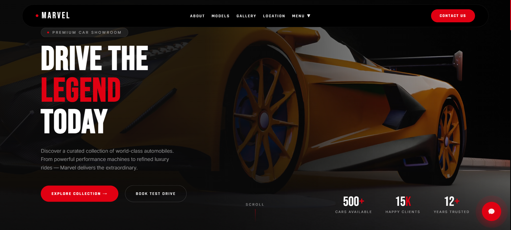
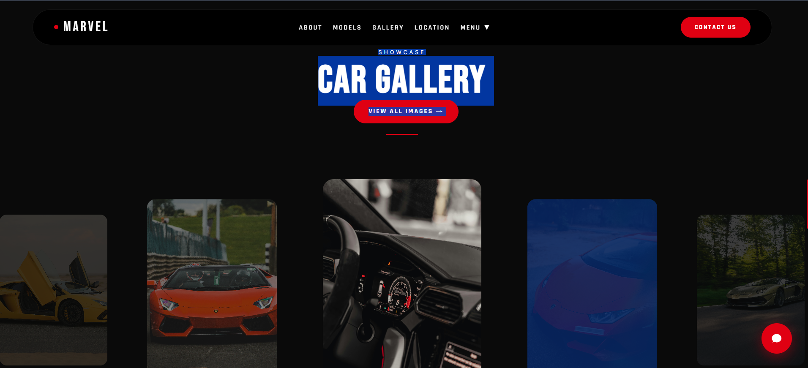
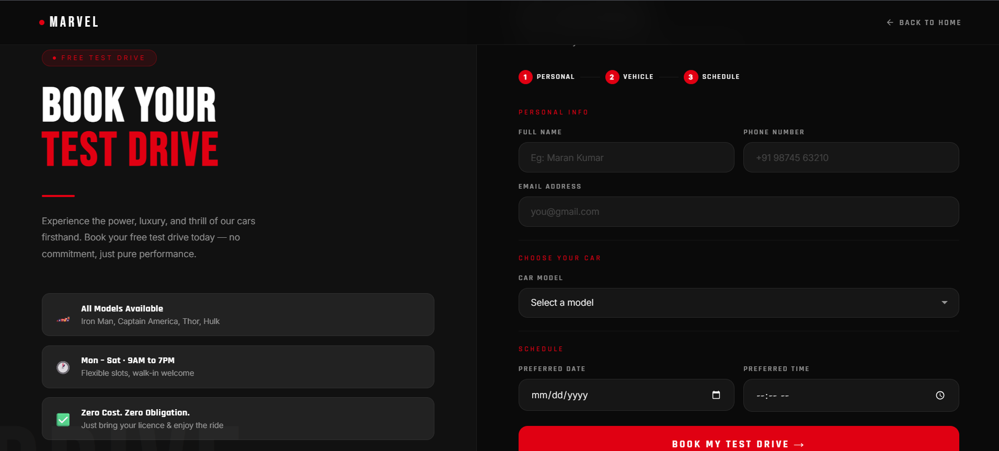

# 🚗 Marvel Showroom

> A modern, responsive luxury car showroom website built using **HTML5, CSS3, and JavaScript** with a clean UI and premium user experience.

---

## 🌐 Live Demo

🔗 **Website**

https://marvel-showroom.vercel.app/

---

## 📂 GitHub Repository

🔗 **Repository**

https://github.com/murasolimaran-ai/marvel-showroom

---

# 📸 Project Preview

### 🏠 Home Page

---

### 🚘 Gallery Cars

---

### ⭐ Car Booking Details 

---

# 📖 Project Overview

Marvel Showroom is a modern luxury car showroom website developed to showcase premium vehicles through an elegant and responsive user interface.

The project focuses on creating a visually appealing browsing experience using only frontend technologies without any backend or database integration.

---

# ✨ Features

- 🚗 Modern Car Showroom Interface
- 📱 Fully Responsive Design
- 🎨 Clean & Premium UI
- ⚡ Smooth Navigation
- 🖼 Interactive Image Sections
- 📋 Car Information Display
- 💻 Cross-Browser Compatible
- 🌙 Attractive Layout
- 🎯 User-Friendly Experience
- ⚙ Lightweight & Fast Loading

---

# 🛠 Tech Stack

## Frontend

- HTML5
- CSS3
- JavaScript

## Design

- Responsive Web Design
- Flexbox
- CSS Grid
- CSS Animations

## Tools

- Visual Studio Code
- Git
- GitHub
- Vercel

---

---

## Open the Project

Simply open **index.html** in your web browser.

or

Use **Live Server** in Visual Studio Code.

---

# 🚀 Usage

1. Clone the repository.
2. Open the project folder.
3. Launch **index.html**.
4. Explore the showroom.
5. Browse featured cars and sections.

---

# 🎯 Learning Outcomes

- Responsive Web Design
- HTML5 Semantic Elements
- CSS3 Layout Techniques
- Flexbox
- CSS Grid
- CSS Animations
- JavaScript DOM Manipulation
- Interactive UI Design
- Modern Frontend Development

---

# 📈 Future Enhancements

- Car Search Feature
- Car Filtering
- Booking System
- User Login
- Dark Mode
- Image Gallery
- Backend Integration
- Database Connectivity
- Online Test Drive Booking

---

# 👨‍💻 Developed By

**Murasolimaran E**

AI Engineer • Full-Stack Developer

---

# 🌐 Connect With Me

💼 **LinkedIn**

https://linkedin.com/in/murasoli-maran

🌍 **Portfolio**

https://maran-portfolio-pi.vercel.app/

🐙 **GitHub**

https://github.com/murasolimaran-ai

📧 **Email**

murasoli2846@gmail.com

---

# 📄 License

This project is licensed under the **MIT License**.

---

# ⭐ Support

If you found this project useful, please consider giving it a ⭐ on GitHub.

---

Made with ❤️ by <b>Murasolimaran E</b>

